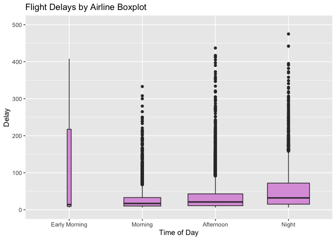

Green Buildings
---------------

The goal is to determine whether tenants will pay a premium to live in
green-certified buildings. From the preliminary recommendation, it
appears that they will. However, we need to make sure that there are no
confounding variables at play.

    green <- read.csv("greenbuildings.csv")

First, we will try to see what variables have a significant impact on
Rent. We do this by fitting a linear model to the data predicting Rent
using all other variables (other than propertyID, cluster, LEED, and
EnergyStar) as a predictor. We remove the LEED and EnergyStar variables
because the green\_rating column accounts for both of them. We will need
to make the green\_rating column a factor, however, instead of a numeric
variable.

    green$green_rating <- factor(green$green_rating)
    M <- lm(Rent~., data=green[,c(3:11,14:23)])
    summary(M)

    ## 
    ## Call:
    ## lm(formula = Rent ~ ., data = green[, c(3:11, 14:23)])
    ## 
    ## Residuals:
    ##     Min      1Q  Median      3Q     Max 
    ## -53.877  -3.593  -0.523   2.491 174.500 
    ## 
    ## Coefficients: (1 not defined because of singularities)
    ##                     Estimate Std. Error t value Pr(>|t|)    
    ## (Intercept)       -7.754e+00  9.970e-01  -7.778 8.34e-15 ***
    ## size               6.720e-06  6.554e-07  10.253  < 2e-16 ***
    ## empl_gr            6.099e-02  1.693e-02   3.602 0.000317 ***
    ## leasing_rate       8.846e-03  5.320e-03   1.663 0.096360 .  
    ## stories           -3.680e-02  1.617e-02  -2.276 0.022866 *  
    ## age               -1.277e-02  4.713e-03  -2.709 0.006763 ** 
    ## renovated         -2.156e-01  2.565e-01  -0.840 0.400711    
    ## class_a            2.854e+00  4.379e-01   6.517 7.62e-11 ***
    ## class_b            1.182e+00  3.428e-01   3.449 0.000565 ***
    ## green_rating1      6.709e-01  3.980e-01   1.686 0.091906 .  
    ## net               -2.532e+00  5.930e-01  -4.270 1.97e-05 ***
    ## amenities          5.890e-01  2.501e-01   2.355 0.018541 *  
    ## cd_total_07       -1.339e-04  1.464e-04  -0.915 0.360107    
    ## hd_total07         5.396e-04  8.944e-05   6.033 1.68e-09 ***
    ## total_dd_07               NA         NA      NA       NA    
    ## Precipitation      4.430e-02  1.597e-02   2.774 0.005558 ** 
    ## Gas_Costs         -3.400e+02  7.606e+01  -4.469 7.96e-06 ***
    ## Electricity_Costs  1.933e+02  2.489e+01   7.767 9.09e-15 ***
    ## cluster_rent       1.008e+00  1.402e-02  71.942  < 2e-16 ***
    ## ---
    ## Signif. codes:  0 '***' 0.001 '**' 0.01 '*' 0.05 '.' 0.1 ' ' 1
    ## 
    ## Residual standard error: 9.418 on 7802 degrees of freedom
    ##   (74 observations deleted due to missingness)
    ## Multiple R-squared:  0.612,  Adjusted R-squared:  0.6111 
    ## F-statistic: 723.8 on 17 and 7802 DF,  p-value: < 2.2e-16

As seen from fitting the linear model, when accounting for the effect of
all other variables in the dataset, we do not see a significant impact
on Rent by green\_rating. This implies that we do not have enough
evidence to say that the coefficient for green\_rating when predicting
Rent is non-zero. The variables that definitely have an impact include
size, class\_a/b, gas/electricity costs, net contract, heating days, and
cluster rent. It’s possible that there may just be too many variables in
the model that are overshadowing the impact of green\_rating, so let’s
try fitting a simpler model. This model will only include green\_rating,
size, class a/b, cluster\_rent, and gas/electricity costs.

    M2 <- lm(Rent~size+green_rating+class_a+class_b+cluster_rent+Electricity_Costs+Gas_Costs, data=green)
    summary(M2)

    ## 
    ## Call:
    ## lm(formula = Rent ~ size + green_rating + class_a + class_b + 
    ##     cluster_rent + Electricity_Costs + Gas_Costs, data = green)
    ## 
    ## Residuals:
    ##     Min      1Q  Median      3Q     Max 
    ## -53.078  -3.695  -0.420   2.354 176.570 
    ## 
    ## Coefficients:
    ##                     Estimate Std. Error t value Pr(>|t|)    
    ## (Intercept)       -3.492e+00  6.594e-01  -5.296 1.21e-07 ***
    ## size               6.206e-06  4.062e-07  15.276  < 2e-16 ***
    ## green_rating1      7.026e-01  3.920e-01   1.792   0.0731 .  
    ## class_a            3.355e+00  3.658e-01   9.171  < 2e-16 ***
    ## class_b            1.473e+00  3.263e-01   4.514 6.46e-06 ***
    ## cluster_rent       1.050e+00  1.180e-02  88.939  < 2e-16 ***
    ## Electricity_Costs  5.944e+01  1.511e+01   3.933 8.46e-05 ***
    ## Gas_Costs         -2.050e+02  4.612e+01  -4.444 8.94e-06 ***
    ## ---
    ## Signif. codes:  0 '***' 0.001 '**' 0.01 '*' 0.05 '.' 0.1 ' ' 1
    ## 
    ## Residual standard error: 9.446 on 7886 degrees of freedom
    ## Multiple R-squared:  0.6077, Adjusted R-squared:  0.6074 
    ## F-statistic:  1745 on 7 and 7886 DF,  p-value: < 2.2e-16

As shown from the output above, even in this simpler model green\_rating
does not have a significant impact on Rent. What the “on-staff stats
guru” was seeing was most likely the effect of a confounding variable.
What this means is that some of the other variables are bringing much
more predictive power to the model than green\_rating, rendering the
effect of green\_rating insignificant. However, when you look at just
green\_rating, it appears there is an effect though this effect is due
to other hidden variables. To confirm this, let’s look at a few plots.

First, let’s just look at the rent for non-green buildings and green
buildings. This should visually lead us to the same conclusion that the
“stats guru” reached.

    ggplot(green, aes(x=Rent)) + geom_density(aes(fill=green_rating), alpha=0.25) + geom_vline(xintercept = median(green[which(green$green_rating == 0),]$Rent), color = "red", linetype = "dashed") + geom_vline(xintercept = median(green[which(green$green_rating == 1),]$Rent), color = "blue", linetype = "dashed") + xlim(0,125) + ggtitle("Rent Density Plot by Green Rating", subtitle = "With Dashed Line Median") + labs(caption = paste0("Difference of medians: ", median(green[which(green$green_rating == 1),]$Rent) - median(green[which(green$green_rating == 0),]$Rent)))

We can indeed see that when just looking at green rating, it does appear
the green buildings have a higher rent than non-green buildings. The
dashed lines represent the medians, and there is the $2.6/sq.ft./year
difference in rent prices. However, as shown by green\_rating being an
insignificant predictor in the linear fits, we know there are other
variables at work. Let’s see if this association still holds when
controlling for other variables. Let’s first control for the class of
the building. We need to create a ‘Class’ variable that can take either,
A, B, or C as a value. This will simply be inferred from the class\_a,
and class\_b columns. We then will plot the rent density plots again,
but split up by each class.

    green$class_c = 0
    green[which((green$class_a == 0) & (green$class_b == 0)),"class_c"] = 1
    green[which(green$class_a==1),"Class"] = "A"
    green[which(green$class_b==1),"Class"] = "B"
    green[which(green$class_c==1),"Class"] = "C"
    green$Class <- factor(green$Class)

    #green <- green %>% group_by(Class, green_rating) %>% mutate(med = median(Rent))

    ggplot(green, aes(x=Rent)) + geom_density(aes(fill=green_rating), alpha=0.25) + xlim(0,125) + ggtitle("Rent Density Plot by Green Rating for each Class") + facet_wrap(~Class, ncol=3) # + geom_vline(aes(xintercept = med, group = Class))

The plots show that for class A and B, the rent density plots are fairly
similar. For class A, the two density plots almost overlap perfectly.
Class B, the green buildings seem to have a slightly higher and later
peak. However, class C has a large difference. It appears that
green-rated buildings in Class C may command a steeper rent. This is
pretty strange, given that A and B don’t have much evidence of that.
Let’s look at the histogram version to see if there is anything strange
quantity-related.

    ggplot(green, aes(x=Rent)) + geom_histogram(aes(fill=green_rating), alpha=0.25) + xlim(0,125) + ggtitle("Rent Density Plot by Green Rating for each Class") + facet_wrap(~Class, ncol=3)

Looking at the histogram confirms that for class A and B, there doesn’t
seem to be much of a difference in rent because of its green status. The
histograms also confirm why we were seeing such strange results for
group C. It appears there is a very low quantity of green-rated
buildings in class C which means that a density plot isn’t a very good
representation. There are so few green buildings in class C that it is
probably unwise to even reach a conclusion about green buildings in
class C.

Let’s check on the medians again, as that was the parameter chosen by
the “stats guru” initially.

    median(green[which(green$Class=="A" & green$green_rating==1),"Rent"]) - median(green[which(green$Class=="A" & green$green_rating==0),"Rent"])

    ## [1] 0.24

    median(green[which(green$Class=="B" & green$green_rating==1),"Rent"]) - median(green[which(green$Class=="B" & green$green_rating==0),"Rent"])

    ## [1] 1.1

The median rent difference between green-rated buildings and non-green
rated buildings in class A is 0.24 and the same measure for class B was
1.1. Both of these are less than half the size of the original 2.6
difference. This shows that controlling for just one variable, Class,
has almost eliminated the impact of green\_rating on rent.

At the risk of stretching our data too thin, let’s also see if size, in
conjunction with class, is making an impact. We first categorize all
buildings and small, medium, or large based on their size. We make the
groups so that each group has approximately the same number of
buildings. We then look at rent price histograms for each combination of
size and class.

    green$sizeCat <- (cut_number(green$size, 3, labels = c("small", "medium", "large")))
    ggplot(green, aes(x=Rent)) + geom_histogram(aes(fill=green_rating), alpha=0.25) + xlim(0,100) + ggtitle("Rent Density Plot by Green Rating for each Class and Size") + facet_wrap(Class~sizeCat, ncol=3)

For class A, we again so no substantial evidence that green-rated
buildings command higher rent prices. The peaks of the histograms are in
roughly the same place with similar distributions. For class B and C, it
looks like we’ve probably stretched our data too thin and can’t reach
any real conclusions.

##### Green Buildings Conclusion

Overall, when we controlled for class, a lot of the impact of
green\_rating on rent prices vanished as shown through the density plots
and histograms. This mirrors the fact that when we run a linear
regression model with all predictors, or even just a handful of
predictors, green\_rating does not show as a significant variable. The
stats guru claimed that green\_rated buildings commanded higher rent
than non-green rated buildings, but this conclusion is likely invalid.
The real impact is likely due to confounding variables such as Class and
Size. The fact that most green buildings are in class A alone means that
they would have higher rent right off the bat. That’s why when we
control for class, we see green\_rating’s impact on rent almost
disappear.

To conclude, there is not enough evidence to claim that green-rated
buildings will rake in more money. However, it may still be worth
building them if only to save the environment!

Flights at ABIA
---------------

Let’s look at the data containing every flight from Austin Bergstrom
International Airport. Let’s quickly see how the number of flights
correlates to the month and the airline.

    ABIA <- read.csv("ABIA.csv")
    #replace NAs in delay columns with 0s
    ABIA[, 25:29][is.na(ABIA[, 25:29])] <- 0
    ggplot(ABIA, aes(factor(Month), fill=UniqueCarrier)) + geom_bar() + xlab("Month") + ylab("Number of Flights") + ggtitle("Number of Flights per Month from ABIA by Airline") 

This data is fairly predictable. There is an uptick in travel during the
summer months, as to be expected with summer vacation and travel. Travel
goes down during the later months. There’s doesn’t appear to be anything
too unique about the air carrier activity by month.

##### Examining Cancellations

Let’s look for any patterns and interesting findings regarding
cancellations and delays at Austin-Bergstrom International Airport in
2008. First, we plot the number of cancellations by month in order to
see when most cancellations occur. We also separate the counts by their
cancellation code which was either “Carrier”, “Weather”, or “NAS”.

    cancelled <- subset(ABIA, Cancelled == 1)
    ggplot(cancelled, aes(factor(Month), Cancelled, fill=CancellationCode)) + geom_bar(stat="identity") + ylab("Number of Cancelled Flights") + xlab("Month") + ggtitle("Number of Flight Cancellations per Month") + scale_fill_discrete(name = "Reason", labels = c("Carrier", "Weather", "NAS"))

This plot provides some interesting insights. Cancellations seem to peak
from January to April, with March having the most cancellations in the
entire year. March experiences a large number of weather-related
cancellations, likely due to some winter weather nationwide. April,
however, experiences a fairly low number of weather-related
cancellations and a very high number of carrier cancellations.

September is a surprising peak. Almost all cancellations are due to
weather. This is likely due to hurricane season, especially Hurricane
Ike in particular which struck mainland Texas.

Month definitely makes a clear impact on cancellations, but does the day
of the week?

    ggplot(cancelled, aes(factor(DayOfWeek), Cancelled, fill=CancellationCode)) + geom_bar(stat="identity") + ylab("Number of Cancelled Flights") + xlab("WeekDay") + ggtitle("Number of Flight Cancellations per Weekday") + scale_fill_discrete(name = "Reason", labels = c("Carrier", "Weather", "NAS"))

Mondays have a noticeable uptick in flight cancellations for some
reason. However, the difference is not overwhelming, so this could just
be a coincidence.

Let’s see which airlines are responsible for the most cancellations.

    ggplot(cancelled, aes(x=UniqueCarrier, y=Cancelled, fill=CancellationCode)) + geom_bar(stat="identity") + ggtitle("Flight Cancellations by Airline") + xlab("Airline") + ylab("Number of Cancelled Flights") + scale_fill_discrete(name = "Reason", labels = c("Carrier", "Weather", "NAS"))

It looks like American Airlines (AA) is responsible for the most
cancellations, but it’s possible that they also operate the most flights
out of the airport. To be fair, let’s look at cancellations as a
proportion of total flights.

    cancelledAF <- data.frame(table(cancelled$UniqueCarrier)/table(ABIA$UniqueCarrier))
    ggplot(cancelledAF, aes(Var1,Freq, fill=Var1)) + geom_bar(stat="identity") + ggtitle("Flight Cancellations by Airline as a Proportion of Total Flights") + xlab("Airline") + ylab("Number of Cancelled Flights") + scale_fill_discrete(name = "Reason", labels = c("Carrier", "Weather", "NAS")) + guides(fill=FALSE)

I’m not familiar with MQ, but a quick search shows it might be Envoy
Air. Whatever airline they are has a very high rate of cancellations,
above 6%. This is a rate more than double that of the next airline, AA
or American Airlines. Travellers may want to avoid booking flights with
MQ and perhaps even American Airlines. On the other hand, Frontier (F9),
Northwest Airlines, and US Airways have very few cancellations.

##### Examining Delays in Flights leaving ABIA

Let’s pivot and look at delays instead of cancellations. For this, we’ll
only look at flights leaving Austin-Bergstrom International Airport in
order to get a better sense of delays for flights leaving Austin. We’ll
consider any flight delayed over 5 minutes; passengers probably don’t
care about a couple minute holdup.

    depAustin <- subset(ABIA, Origin=="AUS")
    nrow(depAustin)

    ## [1] 49623

    delayAustin <- subset(depAustin, DepDelay > 5)
    nrow(delayAustin)

    ## [1] 11843

Out of 49,623 flights that left ABIA in 2008, 11,843 had a delay of over
5 minutes. Similar to cancellations, let’s see which airline is
responsible for the most delays.

    ggplot(delayAustin, aes(UniqueCarrier, fill=UniqueCarrier)) + geom_bar() + guides(fill=FALSE)

Looks like SouthWest Airlines (WN) is responsible for the most delays.
But again, to be fair, we should take delays as a fraction of all
departing flights.

    delayedAF <- data.frame(table(delayAustin$UniqueCarrier)/table(depAustin$UniqueCarrier))
    ggplot(delayedAF, aes(Var1, Freq, fill=Var1)) + geom_bar(stat="identity") + guides(fill=FALSE) + xlab("Airline") + ylab("Frequency") + ggtitle("Frequency of Delays of flights departing ABIA by Airline")

Looks like we were being a bit unfair to Southwest, though it does come
in second for delays behind EV (ExpressJet). US airways and Endeavor
(9E) have very few delays and could be a wise choise for travellers.
Let’s look at how long these carriers’ delays are.

    ggplot(delayAustin, aes(UniqueCarrier, DepDelay)) + geom_boxplot(varwidth=T, fill="plum") + xlab("Carrier") + ylab("Delay") + ggtitle("Flight Delays by Airline Boxplot")

There are some astronomical delays. 9E had a delay clocking in at over
875 minutes, or over 14.5 hours. B6 had a delay clocking in at over 625
minutes or over 10 hours. It’s possible that these could be errors from
the data collection process.

Something that could be interesting to see is whether a certain time of
day is more susceptible to long delays. For this, we will divide the day
into 4 equal parts: early morning (Midnight-6AM), morning (6AM to 12PM),
afternoon (12PM to 6PM), and night (6PM to Midnight).

    delayAustin[which(delayAustin$DepTime <= 600),"DepPeriod"] <- "Early Morning"
    delayAustin[which(delayAustin$DepTime > 600 & delayAustin$DepTime <= 1200),"DepPeriod"] <- "Morning"
    delayAustin[which(delayAustin$DepTime > 1200 & delayAustin$DepTime <= 1800),"DepPeriod"] <- "Afternoon"
    delayAustin[which(delayAustin$DepTime > 1800 & delayAustin$DepTime <= 2400),"DepPeriod"] <- "Night"
    delayAustin$DepPeriod <- factor(delayAustin$DepPeriod, levels = c("Early Morning", "Morning", "Afternoon", "Night"), ordered = TRUE)
    ggplot(delayAustin, aes(DepPeriod, DepDelay)) + geom_boxplot(varwidth=T, fill="plum") + xlab("Time of Day") + ylab("Delay") + ggtitle("Flight Delays by Airline Boxplot") + ylim(0,500)

Early morning really doesn’t have enough flights to make a statement
about delays (as shown by the width of the box). While afternoon has the
most delays, it appears nighttime flights do have a higher average delay
than morning and afternoon, but not by a large amount. It’s worth noting
that the two outliers seen earlier are not shown in this plot because
the y-axis was truncated for easier interpretation.

Let’s see if month or day of the week correlates to longer or more
delays.

    ggplot(delayAustin, aes(factor(Month), fill=factor(DayOfWeek))) + geom_bar() + xlab("Month") + ylab("Number of Delays") + ggtitle("Number of Flight Delays by Month and Day of Week")

Comparing this plot to the earlier plot of cancellations, we can see
that March has the most cancellations and delays. However, there are
some interesting difference in other months. For example, May, June, and
December had a fairly average number of cancellations. However, they
have a very high number of delays. Furthermore, September had many
flight cancellations but very few delays.

Finally, let’s see if the destination of the flight is correlated with
flight delays departing ABIA. Let’s look at the top 10 most delayed
destinations. We’ll also look at how long these delays usually are. For
this, we’ll classify delays as either short (&lt;30 min), moderate
(30-60 min), or long (&gt;60 min).

    delayAustin[which(delayAustin$DepDelay <= 30),"DelayCat"] <- "Short"
    delayAustin[which(delayAustin$DepDelay > 30 & delayAustin$DepDelay <= 60),"DelayCat"] <- "Moderate"
    delayAustin[which(delayAustin$DepDelay > 60),"DelayCat"] <- "Long"
    delayAustin$DelayCat <- factor(delayAustin$DelayCat, levels = c("Short", "Moderate", "Long"), ordered = TRUE)
    dest10 <- names(head(sort(table(delayAustin$Dest), decreasing = TRUE), 10))
    dest10ss <- subset(delayAustin, Dest %in% dest10)
    ggplot(dest10ss, aes(Dest)) + geom_bar(fill="salmon") + xlab("Destination") + ylab("Number of Delays") + ggtitle("Number of Flight Delays by Destination and Length of Delay") + facet_wrap(~DelayCat, ncol=1)

It looks like both the airports in Dallas are responsible for the most
short and moderate delays. This is to be expected due to the huge number
of flights from Austin to Dallas. Interestingly, Chicago O’Hare (ORD)
looks like it comes in 9th for short delays but 2nd for long delays,
meaning that flights from ABIA to Chicago have a disproportionate number
of long delays. Travellers may want to be wary of travelling to Chicago.

##### Wrapping Up

We’ve found several interesting insights about cancellations and delays
at Austin-Bergstrom International Airport in 2008. The winter months of
January through March account for a lot of cancellations, many of which
are weather-related. However, April has an alarming amount of
Carrier-related cancellations. September also experienced a large number
of cancellations, almost all weather-related, likely due to a rough
hurricane season. Travellers have reason to be worried when travelling
on Monday which had the most cancellations out of all weekdays.
Travellers should be even more worried if they’re travelling via MQ
(Envoy Air) which has over 6% of its flights get cancelled! American
Airlines has the second highest fraction of cancellations so it could be
wise to avoid them as well. Frontier, Northwest, and US Airways have
relatively few cancellations.

As far as delays when leaving Austin, it appears that ExpressJet and
Southwest lead the way after adjusting for quantity of total flights. US
Airways and Endeavor have relatively few delays. US Airways begins to
look like a good choice for travellers wanting to avoid cancellations
and delays. Additionally, travellers should be wary of flying at night
which has the longest average delays, though afternoons have the most
delays. Additionally, while the early summer months of May, June, and
July avoid a lot of cancellations, it appears that they experience a lot
of delays. September, which had a large number of weather-related
cancellations, had very few delays. Finally, while both Dallas airports
lead the way in delays, it’s due to the sheer number of flights that go
from Austin to Dallas. However, travellers should be a little worried
when travelling to Chicago O’Hare which has a large number of long
(&gt;60 min) delays.

Portfolio Modeling
------------------

The goal here is to construct three different portfolios containing only
exchange-traded funds and use bootstrap resampling to analyze the
short-term risk, measured by 5% VAR or value-at-risk. The portfolio will
begin with $100,000 in capital and will be traded for 20 days, where
they are rebalanced at the end of every day so that the initial chosen
ratios of funds hold.

I chose three very different portfolios that bear a passing resemblance
to different investment strategies. The first portfolio consists of VTI,
VXUS, and BND. VTI seeks to track the performance of the total stock
market. VXUS seeks to track the performance of international companies.
Finally, BND seeks to track the performance of a broad, market-weight
bond index. These three stocks are recommended very often to beginner
investors and hands-off investors. This portfolio has exposure to US
stocks, international stocks, and the US bond market, so it is regarded
as a fairly low risk portfolio. The weights assigned to this portfolio
are 50% VTI, 30% VXUS, 20% BND. This is a fairly common recommended
ratio for younger investors as it maintains most of its exposure to the
US and international stock market but still has some exposure to the
bond market for stability.

The second portfolio I constructed is a very tech-heavy portfolio. 40%
of its weight goes towards VGT, the Vanguard Information Technology ETF
containing a lot of exposure to companies like Apple and Microsoft.
Another 20% is VOX, the Vanguard Communications ETF containing high
exposure to Facebook, Google, Netflix, and Verizon. Another 20% is VCR,
the Vanguard Consumer Discretionary ETF with high exposure to companies
like Amazon and Tesla. Finally, the last 20% is PSI, the Invesco Dynamic
Semiconductors ETF with exposure to chip companies like Nvidia,
Qualcomm, and AMD.

The third and last portfolio I constructed is a healthcare focused
portfolio. As the saying goes, people will always get sick. 40% of this
portfolio is VHT, the Vanguard Health Care ETF which holds over 300 US
health firms including Johnson&Johnson, UnitedHealth, Merck, Pfizer, and
AbbVie. Another 30% is weighted toward XBI, the SPDR S&P Biotech ETF
which focuses on US biotech firms like Noravax and Invitae. The final
30% is IXJ, the iShares Global Healthcare ETF which provides exposure to
international healthcare firms.

Once we retrieve all the data for these ETFs, we adjust all of them for
splits and dividends and trim the data to only contain the past 5 years,
the time period we will be sampling from. We finally put all of these
into three portfolio matrices for future sampling.

    #1 "safe" ETF portfolio
    portfolio1 = c("VTI", "VXUS", "BND")
    portfolio1_weights = c(0.5, 0.3, 0.2)
    #1 tech heavy ETF portfolio
    portfolio2 = c("VGT", "VOX", "VCR", "PSI")
    portfolio2_weights = c(0.4, 0.2, 0.2, 0.2)
    #1 healthcare and drug focused ETF
    # VHT - US healthcare
    # XBI biotech
    # IXJ - World healthcare
    portfolio3 = c("VHT", "XBI", "IXJ")
    portfolio3_weights = c(0.4, 0.3, 0.3)
    alltickers = c(portfolio1, portfolio2, portfolio3)
    getSymbols(alltickers)

    ##  [1] "VTI"  "VXUS" "BND"  "VGT"  "VOX"  "VCR"  "PSI"  "VHT"  "XBI"  "IXJ"

    #adjust for open, closing, split, dividends, etc for all stocks
    for(ticker in alltickers) {
        expr = paste0(ticker, "a = adjustOHLC(", ticker, ")")
        eval(parse(text=expr))
    }

    #We only want the data for the past 5 years
    alltickersa = c()
    for(ticker in alltickers) {
      alltickersa = c(alltickersa, paste0(ticker,'a'))
    }
    for(tickera in alltickersa) {
      expr = paste0(tickera, "=",tickera, "[paste0((Sys.Date()-(365.2422*5)-1),'/',Sys.Date()-1),]")
      eval(parse(text=expr))
    }

    returns1 = cbind(ClCl(VTIa),ClCl(VXUSa),ClCl(BNDa))
    returns1 = as.matrix(na.omit(returns1))
    returns2 = cbind(ClCl(VGTa),ClCl(VOXa),ClCl(VCRa),ClCl(PSIa))
    returns2 = as.matrix(na.omit(returns2))
    returns3 = cbind(ClCl(VHTa),ClCl(XBIa),ClCl(IXJa))
    returns3 = as.matrix(na.omit(returns3))

After all the portfolio selection and data preprocessing, we are finally
able to run the bootstrap simulation for portfolio 1. We start with an
initial wealth of $100000. We run 5000 bootstrap simulations of 20 days
each, rebalancing the portfolio at the end of each day.

    set.seed(3)
    #portfolio 1
    initial_wealth = 100000
    sim1 = foreach(i=1:5000, .combine='rbind') %do% {
        total_wealth = initial_wealth
        #fairly normal recommended weights
        #half vti, quarter vxus, 20% bonds
        weights = portfolio1_weights
        holdings = weights * total_wealth
        n_days = 20
        wealthtracker = rep(0, n_days)
        for(today in 1:n_days) {
            return.today = resample(returns1, 1, orig.ids=FALSE)
            holdings = holdings + holdings*return.today
            total_wealth = sum(holdings)
            wealthtracker[today] = total_wealth
            #rebalance every day at end of day
            holdings = weights * total_wealth
        }
        wealthtracker
    }
    ggplot() + geom_histogram(aes(sim1[,n_days]), binwidth = 1000, color="blue") + xlab("Final Portfolio Value")

    mean(sim1[,n_days]); median(sim1[,n_days]); sd(sim1[,n_days])

    ## [1] 100804.4

    ## [1] 100952.3

    ## [1] 4268.634

    # 5% VAR
    quantile(sim1[,n_days]- initial_wealth, prob=0.05)

    ##       5% 
    ## -6428.56

From the histogram, we can see that the majority of simulations finish
with the final portfolio value above the initial value of 100,000. In
fact, both the mean and the median are at least 800 dollars over. The
standard deviation is around 4366 dollars. The value of interest,
however, is the 5% value-at-risk. This is calculated to be around -6444
dollars, meaning that 5% of the time, this set of investments lost more
than that value over a 20 day period.

We then duplicate the process for the second portfolio.

    set.seed(3)
    #portfolio 2
    initial_wealth = 100000
    sim2 = foreach(i=1:5000, .combine='rbind') %do% {
        total_wealth = initial_wealth
        #most weight in VGT and split even otherwise
        weights = portfolio2_weights
        holdings = weights * total_wealth
        n_days = 20
        wealthtracker = rep(0, n_days)
        for(today in 1:n_days) {
            return.today = resample(returns2, 1, orig.ids=FALSE)
            holdings = holdings + holdings*return.today
            total_wealth = sum(holdings)
            wealthtracker[today] = total_wealth
            #rebalance every day at end of day
            holdings = weights * total_wealth
        }
        wealthtracker
    }
    ggplot() + geom_histogram(aes(sim2[,n_days]), binwidth = 1000, color="blue")

    # 5% VAR
    mean(sim2[,n_days]); median(sim2[,n_days]); sd(sim2[,n_days])

    ## [1] 101756.1

    ## [1] 101700.2

    ## [1] 6342.446

    quantile(sim2[,n_days]- initial_wealth, prob=0.05)

    ##        5% 
    ## -8672.099

The second portfolio has a slightly wider distribution than the first
portfolio as shown by the histogram and by the standard deviation of
about 6384 dollars. On average, the portfolio performs better than the
first, with a mean and median of over 1700 dollars higher than the
starting amount. However, the 5% value-at-risk is also higher, at around
-8708 dollars, meaning that 5% of the time, this set of investments lost
more than 8708 dollars over a 20 days period.

Finally, we repeat this process for the third portfolio.

    set.seed(3)
    #portfolio 2
    initial_wealth = 100000
    sim3 = foreach(i=1:5000, .combine='rbind') %do% {
        total_wealth = initial_wealth
        #weighted a little in favor of US healthcare
        weights = portfolio3_weights
        holdings = weights * total_wealth
        n_days = 20
        wealthtracker = rep(0, n_days)
        for(today in 1:n_days) {
            return.today = resample(returns3, 1, orig.ids=FALSE)
            holdings = holdings + holdings*return.today
            total_wealth = sum(holdings)
            wealthtracker[today] = total_wealth
            #rebalance every day at end of day
            holdings = weights * total_wealth
        }
        wealthtracker
    }
    ggplot() + geom_histogram(aes(sim3[,n_days]), binwidth = 1000, color="blue")

    mean(sim3[,n_days]); median(sim3[,n_days]); sd(sim3[,n_days])

    ## [1] 102334

    ## [1] 101040.2

    ## [1] 10884.88

    # 5% VAR
    quantile(sim3[,n_days]- initial_wealth, prob=0.05)

    ##        5% 
    ## -8818.801

The ending values of this portfolio has a very different distribution
from the first two with a very prominent right skew. There is even an
ending portfolio value of over 300000 dollars! This variability is shown
by the standard deviation of almost 11000, the highest seen by far. The
portfolio performs well on average with a median of over 1250 dollars
higher than the starting value. The mean is even higher due to the right
skew. The 5% value-at-risk is the highest seen yet at around -8928
dollars. This means that 5% of the time, this portfolio loses over 8928
dollars over a 20 day period.

##### Portfolio Modeling Conclusions

Overall, this analysis shows the tradeoff of risk and reward in the
market. The first portfolio is the safest, with exposure to the entire
market and exposure to the bond market, a historically safe investment.
For this reason, its returns are usually not exceptional but they are
also not very volatile as shown by the fairly low 5% value-at-risk. The
second portfolio, with exposure to various facets of technology,
performed better on average than the first but also carried a higher
risk with a 5% value-at-risk almost 2000 dollars higher than the first.
Technology is usually regarded as a good risk for growth investors due
to the high valuations and growth of FAANG-type stocks. However, we can
see that exposure to only one sector does carry more risk than a more
balanced approach like portfolio 1. Finally, the third portfolio had the
greatest volatility. Some simulations even had the portfolio doubling or
tripling its value after 20 days, an incredible outcome. However, it
also had the highest 5% value-at-risk and standard deviation meaning
that it carried the most risk and volatility out of all portfolios. This
mirrors the overall nature of healthcare investments. Healthcare,
especially biotech firms, are regarded as very risky and volatile
investments and is prone to huge swings dependent on events such as FDA
approval or denial. This can lead to some huge wins but also very
substantial losses.

Market Segmentation
-------------------

In order to generate some insights about segments within NutrientH20s
audience, we will create clusters of similar users so that they have
unique groups for which they can generate tailor-made marketing
approaches. First, we need to clean the data a little bit. We remove all
users that have tweeted spam or adult content because we want to ensure
there are no bots in the dataset and any adult content is not very
useful for marketing insights. We also remove the spam and adult columns
completely. Finally, we remove the chatter and uncategorized columns as
well because they will not provide us a lot of information when creating
unique market segments. We then scale and center all attributes so their
impact on any models are fair and equal.

    #preprocessing
    smark <- read.csv("social_marketing.csv", row.names = 1)
    smark <- smark[-which((smark$spam > 0) | (smark$adult > 0)),]
    smark <- smark[ , !(names(smark) %in% c("spam", "adult", "chatter", "uncategorized"))]
    smark_avg <- data.frame(apply(smark,2,mean))
    smark_avg$cat <- rownames(smark_avg); rownames(smark_avg) <- NULL; colnames(smark_avg) <- c("mean", "cat")
    smark_scaled <- scale(smark, center = TRUE, scale = TRUE)
    mu = attr(smark_scaled,"scaled:center")
    sigma = attr(smark_scaled,"scaled:scale")

In order to generate clusters using a kmeans approach, we need to
determine how many clusters to use. We don’t want too many because it
will be hard for NutrientH20s marketing team to develop too many
marketing campaigns. However, we don’t want to few because targeted
marketing only works if the groups are unique enough. We first attempt
to create an elbow plot to find an optimal number of clusters.

    set.seed(3)
    k_grid <- seq(2,20,by=1)
    SSE_grid <- foreach(k=k_grid, .combine = 'c') %do% {
      cluster_k = kmeans(smark_scaled,k,nstart=25)
      cluster_k$tot.withinss
    }
    plot(k_grid, SSE_grid)

Unfortunately, this elbow plot doesn’t have much of an elbow. Let’s see
if the CH index will give us a clearer picture for how many clusters to
choose.

    set.seed(3)
    N = nrow(smark_scaled)
    CH_grid = foreach(k = k_grid, .combine = 'c') %do% {
      cluster_k = kmeans(smark_scaled, k, nstart = 25)
      W = cluster_k$tot.withinss
      B = cluster_k$betweenss
      CH = (B/W) * ( (N-k)/(k-1) )
      CH
    }
    plot(k_grid, CH_grid)

It looks like 3, 4, or 5 clusters might be a good start. Let’s choose 5
because 5 different marketing groups seems like a good compromise
between uniqueness of groups and difficulty of creating different
campaigns. NutrientH20s marketing team should be able to work with 5
groups of unique users in their audience.

We fit a kmeans model with 5 clusters on the scaled data, and then
unscale the cluster centers to get a representation of our clusters in
the original domain. In order to determine which qualities of each
cluster are unique, we plot the average topic values for each cluster
against the average topic values for the entire dataset. This will show
how clusters stand out against each other and against the general
audience.

    set.seed(3)
    clust1 <- kmeans(smark_scaled, 5, nstart = 25)
    unscaled <- clust1$centers*sigma + mu
    for(i in 1:nrow(unscaled)){
      clustmeans <- unscaled[i,]
      smark_avg[,paste0('Cluster ',i)] <- clustmeans
      dfmelt <- melt(smark_avg, id.vars='cat')
      smark_avg[,paste0('Cluster ',i)] <- NULL
      print(ggplot(dfmelt,aes(x = cat,y = value, fill = variable)) + geom_bar(stat="identity", position = "dodge") + coord_flip() + ylab("Category") + xlab("Mean/Cluster Center") + ggtitle(paste0("Cluster ",i)))
    }

There are several interesting insights here. Cluster 1 seems to include
a lot of music fans as tweets about music appear over twice as many
times from the users in Cluster 1 as they do on average in the whole
dataset. Users in this cluster also have distinctly low
interest/activity in personal fitness, photo sharing, politics, and
sports fandom. Therefore, a marketing approach focusing on music and
avoiding fitness, politics, and sports would be a good idea to target
this group.

Users in Cluster 2 have an overwhelming amount of tweets about school.
They also have a distinct interest in family and parenting. NutrientH20
should consider a marketing approach targeting these interests such as a
campaign about how their product is the perfect beverage to take to
school.

Cluster 3 has a lot of tweets about automotives and playing sports. This
could be an interesting subset of users for NutrientH20 to market
towards. Users in this cluster also seem to have an interest in news,
politics, and current events. While the latter topics might not make for
a promising marketing campaign, it could be useful information to have.

Users in the fourth cluster seem to have an interest in beauty,
business, fashion, music, and photo-sharing. Most of these interests are
very related to each other, so NutrientH20 could form a very targeted
marketing campaign to appeal to users in this group.

Finally, Cluster 5 has users who tweet a lot about health, nutrition,
food, and crafts. This should be a great group for NutrientH20 to target
because it seems to contain a lot of health-conscious individuals and
food-lovers. If NutrientH20 can market their product as a nutritious and
healthy option for hydration, they should appeal to users in this group.

Overall, these 5 clusters are all fairly unique and provide NutrientH20
with very interest market segments. They can definitely create
approaches to appeal to users based on which group they are in and what
interests they have. If NutrientH20s marketing team can handle more
clusters, this analysis could be rerun to make more clusters that would
be even more targeted.

Author Attribution
------------------

To get started, we have to do a lot of data wrangling here. First, we
need to get all these documents into a dataframe that would be
appropriate for running some analysis on. The end goal here is a
dataframe with one column being the author name as a factor and then the
remaining columns being the full tf-idf vector for that document. This
first step is to read in each document and concatenate all the text that
document contains as one long string. We then create a Corpus from that
document string and make all words lowercase, remove numbers, remove
punctuation, and strip whitespace. We end by removing stop words, using
a basic English stop words package. This removes filler words like
“the”, “for”, etc. These words don’t give us much predictive power. We
then create a Document Term Matrix out of the remaining terms and remove
sparse terms using a 95% threshold. We then finally create a TF-IDF
matrix from these documents and add them to a dataframe with the author
as the first column.

    readerPlain = function(fname){
                    readPlain(elem=list(content=readLines(fname)), 
                                id=fname, language='en') }

    #get all authors for the documents
    authors <- rep("", 50)
    i <- 1
    for (f in Sys.glob('./ReutersC50/C50train/*')){
      authors[i] <- tail(strsplit(f, "/")[[1]], 1)
      i <- i+1
    }
    #since each author has 50 documents, we need to replicate each author 50 times for the dataframe
    authors <- rep(authors, each=50)

    #instantiate dataframe with first column being authors
    train_df <- data.frame(author=authors, txt=rep("", 2500), stringsAsFactors = FALSE)

    #add in text for each document after concatening all lines with a space
    file_list_train = Sys.glob('./ReutersC50/C50train/*/*.txt')
    trainfiles = lapply(file_list_train, readerPlain)
    for(i in 1:length(trainfiles)){
      contentvec <- trainfiles[[i]]$content
      train_df[i,2] <- paste(contentvec, collapse = " ")
    }

    #text preprocessing, explained above
    documents_raw_train = Corpus(VectorSource(train_df$txt))
    my_documents_train = documents_raw_train %>%
      tm_map(content_transformer(tolower))  %>%
      tm_map(content_transformer(removeNumbers)) %>%      
      tm_map(content_transformer(removePunctuation)) %>%  
      tm_map(content_transformer(stripWhitespace)) 
    my_documents_train = tm_map(my_documents_train, content_transformer(removeWords), stopwords("en"))
    DTM_train = DocumentTermMatrix(my_documents_train)
    DTM_train = removeSparseTerms(DTM_train, 0.95)
    tfidf_train = as.matrix(weightTfIdf(DTM_train))

    #create the final dataframe with the author as a factor and the tf-idf matrix
    train_full <- cbind(train_df, tfidf_train)
    train_full <- train_full[,-2] #drop the column with the full text
    train_full$author <- factor(train_full$author)

Let’s see what a small window of this dataframe looks like now.

    train_full[48:52,1:5]

    ##           author access        also announced authorities
    ## 48 AaronPressman      0 0.000000000         0           0
    ## 49 AaronPressman      0 0.007757779         0           0
    ## 50 AaronPressman      0 0.014266875         0           0
    ## 51    AlanCrosby      0 0.000000000         0           0
    ## 52    AlanCrosby      0 0.002462132         0           0

We also need to do this to the test documents so that they can be
inputted into the predictive model that we create. We follow a very
similar process, with one difference. When removing sparse terms, we use
a 98% threshold. This saves more of the terms. The reason for doing this
is that we next have to remove all terms that did not appear in the
train documents. We lose predictive power doing this, so we want to make
sure we retain as many terms as possible.

Removing all terms from the test documents that did not appear in the
train documents allows us to run the predictive models on the train
data. However, we lose a lot of information when we do that. There are
workarounds such as creating a “not-seen-before” word column, but I
thought simply removing the words that did not appear in the test
document was a fair compromise.

    authors <- rep("", 50)
    i <- 1
    for (f in Sys.glob('./ReutersC50/C50test/*')){
      authors[i] <- tail(strsplit(f, "/")[[1]], 1)
      i <- i+1
    }
    authors <- rep(authors, each=50)

    test_df <- data.frame(author=authors, txt=rep("", 2500), stringsAsFactors = FALSE)

    file_list_test = Sys.glob('./ReutersC50/C50test/*/*.txt')
    testfiles = lapply(file_list_test, readerPlain)
    for(i in 1:length(testfiles)){
      contentvec <- testfiles[[i]]$content
      test_df[i,2] <- paste(contentvec, collapse = " ")
    }

    documents_raw_test = Corpus(VectorSource(test_df$txt))
    my_documents_test = documents_raw_test %>%
      tm_map(content_transformer(tolower))  %>%
      tm_map(content_transformer(removeNumbers)) %>%      
      tm_map(content_transformer(removePunctuation)) %>%  
      tm_map(content_transformer(stripWhitespace)) 
    my_documents_test = tm_map(my_documents_test, content_transformer(removeWords), stopwords("en"))
    DTM_test = DocumentTermMatrix(my_documents_test)
    DTM_test = removeSparseTerms(DTM_test, 0.98)
    tfidf_test = as.matrix(weightTfIdf(DTM_test))

    #only retain columns that are present in the test dataframe
    tfidf_test <- tfidf_test[, intersect(colnames(tfidf_train), colnames(tfidf_test))]

    test_full <- cbind(test_df, tfidf_test)
    test_full <- test_full[,-2] #drop the column with the full text
    test_full$author <- factor(test_full$author)

We can now start building some predictive models! The first model we
will try is a k-nearest-neighbors model. We will try different values of
k among 5,10,15,20. After fitting each model, we use it to predict on
the test documents and compute the accuracy.

    for(k in c(5,10,15,20)){
      near = kknn(author~., #Formula (a point means that all covariates are used)
                  train = train_full, #Train matrix/df
                  test = test_full, #Test matrix/df
                  k=k, #Number of neighbors
                  kernel = "rectangular")
      cat(paste0("k of ",k," has test set error of ",mean(near$fitted.values == test_full$author)), "\n")
    }

    ## k of 5 has test set error of 0.2692 
    ## k of 10 has test set error of 0.2496 
    ## k of 15 has test set error of 0.2136 
    ## k of 20 has test set error of 0.2048

It looks like the model with a k of 5 performs the best, with almost 27%
accuracy. This isn’t great but it is much better than if the model just
picked an author at random. The baseline accuracy in this situation is
1/50 or 2%. 27% is a definite improvement.

Let’s try a random forest model and see if it performs any better. We
will use an mtry of 5 (this is how many variables it considers at each
partition) and 500 trees as fairly standard parameters.

    set.seed(3)
    #had to add a suffix to variable names for some reason, randomforest was getting confused
    colnames(train_full) <- paste(colnames(train_full), "_rf", sep = "")
    rffit = randomForest(author_rf~.,
                         data=train_full,
                         mtry=5,
                         ntree=500)

    colnames(test_full) <- paste(colnames(test_full), "_rf", sep = "")
    rfpred <- predict(rffit, test_full)
    mean(test_full$author_rf == rfpred)

    ## [1] 0.5984

The random forest model performs very well, achieving an accuracy of
almost 60%. This is a massive improvement over the k-nearest-neighbors
model.

Finally, let’s fit a decision tree and compute its accuracy.

    Mtree <- rpart(author_rf~., data=train_full, method="class")
    treePred <- predict(Mtree, test_full[,-1], type="class")
    mean(test_full$author_rf == treePred)

    ## [1] 0.2396

The decision tree does not perform very well unfortunately, achieving an
accuracy of only about 24% on the test dataset.

##### Author Attribution Conclusions

Creating a model to predict the author of articles is no easy task. Just
the preprocessing itself is fairly tedious. However, once the data is
laid out to where the author is paired with the tf-idf values for that
document, creating predictive models is a less arduous task. My model
disregards words that appear in the test dataset that didn’t appear in
the train dataset (after preprocessing) and this could have led to a
compromise in accuracy. However, the random forest model still performs
very well, with an accuracy of almost 60%. When compared to the baseline
accuracy of a naive model of just 2%, this is a great improvement. KNN
and decision tree based models perform worse, though. The KNN model
achieved an accuracy of 27% while decision tree had an accuracy of about
24%. These are still improvement over a random guess, however, so all
models did bring some predictive power.

Association Rule Mining
-----------------------

Let’s take a look at grocery baskets and see if we can find any useful
associations. We will look for all rules with a support over 0.005, a
confidence of at least 0.1, and a maximum length of 4. The support level
means that the items in the rule must appear in at least .5% of grocery
baskets. We set this level so that we see rules that are useful and
insightful and not very rare purchases. If we wanted to place products
based on these rules, we would not want to make decisions on what a very
small fraction of customers (less than 0.5%) want. Next, the confidence
of at least 0.15 means that at least 15% of customers that buy the
product(s) on the left hand side of the rule will buy the product(s) on
the right hand side. We set this for a similar reason: we want
meaningful correlations. Finally, we set the maximum length to 4 to
limit the basket size. It’s a lot harder to interpret and gather
insights from very large baskets, so we would prefer to only be looking
at a few items every time.

    groceries <- read.transactions("groceries.txt", header = FALSE, sep=",")
    groceryrules = apriori(groceries, parameter=list(support=.005, confidence=.15, maxlen=4))

    ## Apriori
    ## 
    ## Parameter specification:
    ##  confidence minval smax arem  aval originalSupport maxtime support minlen
    ##        0.15    0.1    1 none FALSE            TRUE       5   0.005      1
    ##  maxlen target   ext
    ##       4  rules FALSE
    ## 
    ## Algorithmic control:
    ##  filter tree heap memopt load sort verbose
    ##     0.1 TRUE TRUE  FALSE TRUE    2    TRUE
    ## 
    ## Absolute minimum support count: 49 
    ## 
    ## set item appearances ...[0 item(s)] done [0.00s].
    ## set transactions ...[169 item(s), 9835 transaction(s)] done [0.00s].
    ## sorting and recoding items ... [120 item(s)] done [0.00s].
    ## creating transaction tree ... done [0.00s].
    ## checking subsets of size 1 2 3 4 done [0.00s].
    ## writing ... [1162 rule(s)] done [0.00s].
    ## creating S4 object  ... done [0.00s].

    length(groceryrules)

    ## [1] 1162

Looks like we end with 1162 rules. Let’s take a look at some of the most
common baskets, that is the rules with the highest support.

    topsupport <- sort(groceryrules, decreasing = TRUE, by = "support")
    arules::inspect(head(topsupport,10))

    ##      lhs                   rhs                support    confidence
    ## [1]  {}                 => {whole milk}       0.25551601 0.2555160 
    ## [2]  {}                 => {other vegetables} 0.19349263 0.1934926 
    ## [3]  {}                 => {rolls/buns}       0.18393493 0.1839349 
    ## [4]  {}                 => {soda}             0.17437722 0.1743772 
    ## [5]  {other vegetables} => {whole milk}       0.07483477 0.3867578 
    ## [6]  {whole milk}       => {other vegetables} 0.07483477 0.2928770 
    ## [7]  {rolls/buns}       => {whole milk}       0.05663447 0.3079049 
    ## [8]  {whole milk}       => {rolls/buns}       0.05663447 0.2216474 
    ## [9]  {yogurt}           => {whole milk}       0.05602440 0.4016035 
    ## [10] {whole milk}       => {yogurt}           0.05602440 0.2192598 
    ##      lift     count
    ## [1]  1.000000 2513 
    ## [2]  1.000000 1903 
    ## [3]  1.000000 1809 
    ## [4]  1.000000 1715 
    ## [5]  1.513634  736 
    ## [6]  1.513634  736 
    ## [7]  1.205032  557 
    ## [8]  1.205032  557 
    ## [9]  1.571735  551 
    ## [10] 1.571735  551

Looks like the most common basket is one containing whole milk. Over 25%
of consumers purchase whole milk! The next most common are ‘other
vegetables’, rolls/buns, and soda, and these are all single-item
baskets. Then, we see some baskets with two items. Consumers buy ‘other
vegetables’ and whole milk together over 7% of the time, and they buy
whole milk and rolls/buns together over 5% of the time. The confidence
on these rules are moderately high, showing that customers that buy the
left hand side items are buying the right hand side items fairly often.
However, the lifts are fairly low, showing that these rules aren’t
giving us a lot of meaningful insights even when we know a customer has
the left-hand-side item in their basket. Consumers just buy these items
a lot for the most part.

Let’s take a look at some of the high confidence rules.

    topconf <- sort(groceryrules, decreasing = TRUE, by = "confidence")
    arules::inspect(head(topconf,10))

    ##      lhs                     rhs                    support confidence     lift count
    ## [1]  {root vegetables,                                                               
    ##       tropical fruit,                                                                
    ##       yogurt}             => {whole milk}       0.005693950  0.7000000 2.739554    56
    ## [2]  {other vegetables,                                                              
    ##       pip fruit,                                                                     
    ##       root vegetables}    => {whole milk}       0.005490595  0.6750000 2.641713    54
    ## [3]  {butter,                                                                        
    ##       whipped/sour cream} => {whole milk}       0.006710727  0.6600000 2.583008    66
    ## [4]  {pip fruit,                                                                     
    ##       whipped/sour cream} => {whole milk}       0.005998983  0.6483516 2.537421    59
    ## [5]  {butter,                                                                        
    ##       yogurt}             => {whole milk}       0.009354347  0.6388889 2.500387    92
    ## [6]  {butter,                                                                        
    ##       root vegetables}    => {whole milk}       0.008235892  0.6377953 2.496107    81
    ## [7]  {curd,                                                                          
    ##       tropical fruit}     => {whole milk}       0.006507372  0.6336634 2.479936    64
    ## [8]  {citrus fruit,                                                                  
    ##       root vegetables,                                                               
    ##       whole milk}         => {other vegetables} 0.005795628  0.6333333 3.273165    57
    ## [9]  {other vegetables,                                                              
    ##       pip fruit,                                                                     
    ##       yogurt}             => {whole milk}       0.005083884  0.6250000 2.446031    50
    ## [10] {domestic eggs,                                                                 
    ##       pip fruit}          => {whole milk}       0.005388917  0.6235294 2.440275    53

These rules provide some interesting insights that could definitely help
a store place products. For example, the fifth rule tells us that when a
customer buys butter and yogurt, they also buy whole milk almost 64% of
the time. The lift tells us that there’s a 250% increase in expectation
that someone will buy milk if we know that they have butter and yogurt
in their cart. Stores should probably keep these products close
together. We can notice that all 10 of these rules contain whole milk.
This is because people buy whole milk a lot; we already saw that when
looking at the highest support rules. In order to get the most
interesting and actionable insights, we should look at some of the rules
with the highest lift.

    toplift <- sort(groceryrules, decreasing = TRUE, by = "lift")
    arules::inspect(head(toplift,10))

    ##      lhs                     rhs                      support confidence     lift count
    ## [1]  {ham}                => {white bread}        0.005083884  0.1953125 4.639851    50
    ## [2]  {citrus fruit,                                                                    
    ##       other vegetables,                                                                
    ##       whole milk}         => {root vegetables}    0.005795628  0.4453125 4.085493    57
    ## [3]  {butter,                                                                          
    ##       other vegetables}   => {whipped/sour cream} 0.005795628  0.2893401 4.036397    57
    ## [4]  {herbs}              => {root vegetables}    0.007015760  0.4312500 3.956477    69
    ## [5]  {citrus fruit,                                                                    
    ##       pip fruit}          => {tropical fruit}     0.005592272  0.4044118 3.854060    55
    ## [6]  {berries}            => {whipped/sour cream} 0.009049314  0.2721713 3.796886    89
    ## [7]  {other vegetables,                                                                
    ##       tropical fruit,                                                                  
    ##       whole milk}         => {root vegetables}    0.007015760  0.4107143 3.768074    69
    ## [8]  {whipped/sour cream,                                                              
    ##       whole milk}         => {butter}             0.006710727  0.2082019 3.757185    66
    ## [9]  {root vegetables,                                                                 
    ##       whole milk,                                                                      
    ##       yogurt}             => {tropical fruit}     0.005693950  0.3916084 3.732043    56
    ## [10] {other vegetables,                                                                
    ##       pip fruit,                                                                       
    ##       whole milk}         => {root vegetables}    0.005490595  0.4060150 3.724961    54

Now we’re seeing some really interesting associations. The highest-lift
rule tells us that there’s a 464% increase in expectation that someone
will buy white bread if they buy ham. This makes sense as they’re
probably gonna make a lunch sandwich. The 4th rule tells us that there’s
a 395% increase in expectation that someone will buy root vegetables if
they buy herbs. They’re probably going to make a vegetable focused
dinner. The 6th rule reveals that there is a 379% increase in
expectation that someone will buy whipped/sour cream if they buy
berries. These customers are likely on their way to make a parfait! This
grocery store would be wise to position items in the baskets on this
list close together so that there is as little friction as possible for
customers to get what they need. It might also spark the thoughts of
customers who weren’t even looking for those items. For example, if a
customer walked buy some ham and white bread next to each other, it
might jog their memory that they need a lunch for work next week.

Let’s try to visualize clusters of items by creating a graph.

    saveAsGraph(head(groceryrules, n = 1000, by = "lift"), file = "groceryrules.graphml")

As seen in the image above, there are definitely some distinct clusters
appearing from the association rules. It looks like there are two large
clusters in the middle, then some medium-sized clusters surrounding
them. The larger the cluster, the more rules it likely appears in and
the more crucial it is to the entire network. Let’s add some labels so
we can see what items are in the clusters.

We can now see that the two biggest clusters are centered on whole milk
and other vegetables. This is to be expected as these two items were
present in many of the baskets. The medium-sized clusters include one
with yogurt, one with tropical fruit, one with root vegetables, and one
with rolls/buns. Some smaller clusters include sausage, sodas,
whipped/sour cream and bottled water. This graph gives us a good view of
which items are popular and important in the grocery store. The bigger
the text label, the higher the degree of the node, meaning the more
association rules it is a part of. Also the position of the items
reveals some insights as well. Fruit is close to both yogurt and
whipped/sour cream indicating that it is often purchased with those
items. This is due to people making parfaits and similar meals.
Rolls/buns is close to the meat cluster and the soda cluster. This is a
classic American meal. Vegetables are fairly close to fruit as well as
signify a likely association among health-conscious shoppers. Overall,
looking at support/confidence/lift and the accompanying graph
visualization can really help this grocery store decide how to advertise
to its consumers and position items within the store to make sure
customers can know and easily get to what they need.
